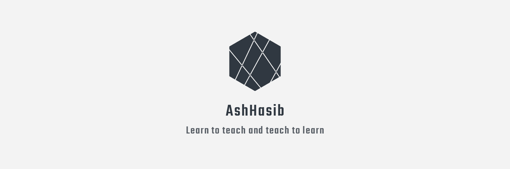

# My Last Stand

My life as an undergraduate has almost come to an end. Within the remaining time, I want to revise and improve my problem solving skills including data structures & algorithms as job interview preparation. That is why I created this repository to store all my last minute works. They maybe text, code or images. The codes may be of different languages. I will update the README file by time and progress of work.

## Things I am willing to put here:

* Online judge problem solutions
 - Hackerrank
 - UVa Onlinejudge
 - Codeforces
 
* Mathematical Theory implementations
 - Number theory
 - Basic mathematical problems
 - Greedy Algorithm
 - Dynamic Programming
 - Graph Algorithms
 - Data Structures
